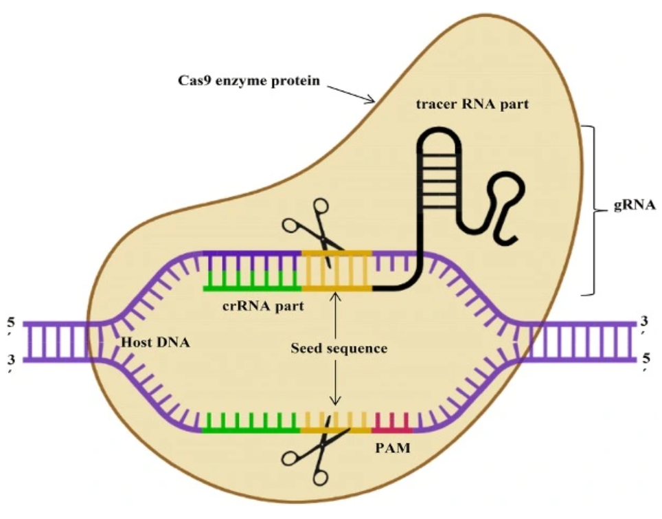
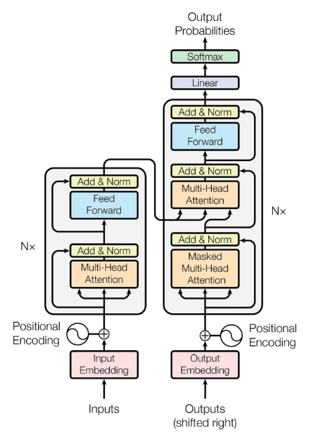
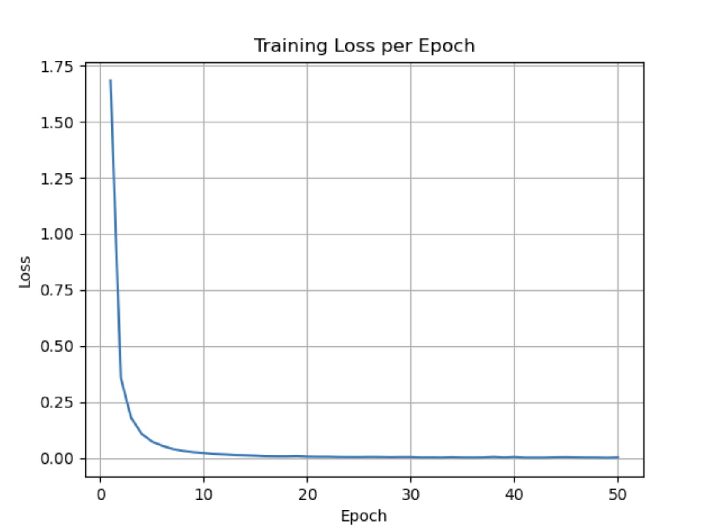
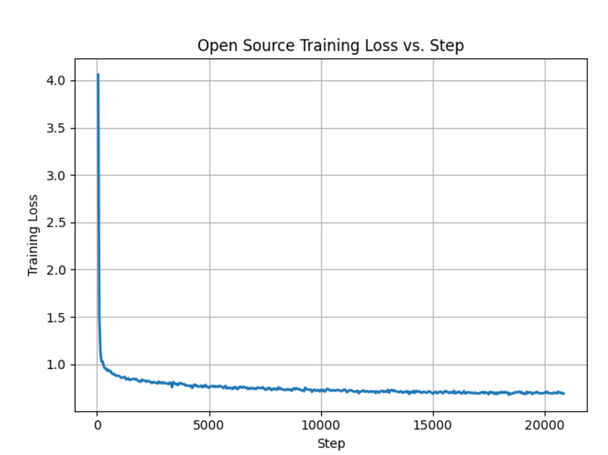
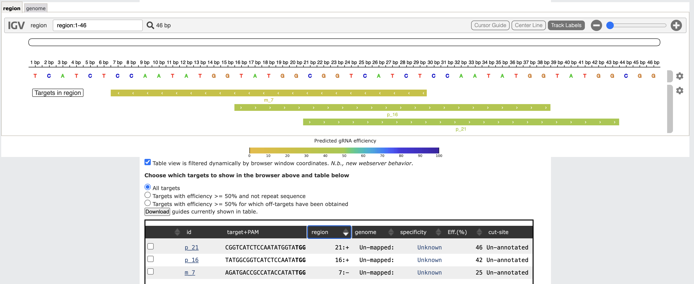

# ECE 285 - CRISPR CAS9 Generator

# A Transformer-Based Generative Model for Efficient and Specific CRISPR gRNA Design

**Tien Vu · Daniel Chen · Anton John Del Mar**

Electrical and Computer Engineering  
University of California, San Diego

`tqvu@ucsd.edu` · `dychen@ucsd.edu` · `adelmar@ucsd.edu`

This is inline math: $p_\theta(x \mid y)$

$$
p_\theta(w_1, \dots, w_n)
=
\prod_{i=1}^{n} p_\theta(w_i \mid w_{1:i-1})
$$

## Abstract

There are a lot of potential health improvements with the development of genome editing through CRISPR-Cas9. CRISPR-Cas9 is a gene-editing tool that uses a guide RNA to direct the Cas9 enzyme to a specific DNA sequence, where it makes a precise cut to modify the gene. In this project, we use transformers to generate gRNA sequences for CRISPR-Cas9 in hopes to develop a method of creating the most efficient gRNA of a given target DNA sequence.

## Motivation

CRISPR-Cas9 is a gene-editing tool that uses a guide RNA (gRNA) to direct the Cas9 enzyme to a specific DNA sequence, where it makes a precise cut to modify the gene. Predictive ranking models are oftentimes used to identify which gRNA sequence in a pre-existing pool will yield the most activity (i.e. effectiveness) at a particular DNA test site [3]. However, these pre-existing gRNA pools are typically obtained using rule-based heuristics and empirically validated by researchers [4]. Thus, the input pool may fail to capture other possible high-efficiency gRNAs that fall outside of these rules.

With that said, having a model that can generate new gRNA sequences and score them can provide greater insight for researchers to determine if they already have an optimal gRNA sequence or if there are better options they can test. Our paper will investigate the possible advantages of a transformer-based approach and its ability to accelerate optimal gRNA discovery with scored sequences. This expands the existing search pool and helps researchers identify gRNA sequences with higher predicted activity for a given DNA target site.

*Figure 1: CRISPR-Cas9 system is a monomeric protein consisting of a single Cas9 enzyme that makes a complex with a guide RNA (gRNA) [10].*

## Problem

Gene editing remains at the forefront of modern biomedical research, holding immense potential for the treatment of unique genetic disorders and complex diseases. Of these technologies, CRISPR-Cas9 is a widely-used approach that relies on gRNA to direct Cas9 enzymes to a target DNA site for precise genomic modifications [5]. The accuracy and effectiveness of CRISPR-Cas9 heavily depends upon the construction of the gRNA, such that it closely matches the target sequence to maximize on-target activity while minimizing off-target edits [6].

However, gRNA design is a non-trivial optimization problem that must balance tightly-coupled biological factors, such as PAM compatibility, sequence features, genomic location, and self-complementarity [6][8][11]. In this context, deep generative models stand out as an opportunity to synthesize optimal gRNA sequences given an input target DNA sequence.

## Related Works

Although CRISPR was first discovered in 1987, it was not until 2012 that Nobel Laureates Jennifer Doudna and Emmanuelle Charpentier discovered the use of the CRISPR-Cas9 system in precise gene editing [5]. Despite the relative novelty of this technology, research in improving CRISPR-Cas9 is ever expanding.

This includes predictive ranking models that score existing gRNA efficiency based on a target sequence and contextual features, heuristic rule-based models that generate gRNAs without deep learning, and existing generative models that are still at their infancy. However, each of these approaches all have their limitations which we aim to address with our approach.

Rankers are trained on data of gRNA that have been tested and bound to Cas9 and how well they perform at the reaching their target [7]. They may face biases in their ranking, favouring gRNA similar to their training set. Relative rankers are also limited to only scoring existing gRNA performance, but it cannot generate the gRNA itself and needs users to find their own sequences to test on.

If a user were to generate gRNAs that are based on poor assumptions, a ranking model will still output a best performing gRNA despite all of them being from a suboptimal pool [7]. Existing heuristic models such as CHOPCHOP are limited by the rules researchers know for generating gRNA but may be missing features and patterns that can be learned by deep learning models [7][6]. A hybrid of a heuristic rule-based and a deep generative model could improve both shortcomings.

Lastly, deep generative models such as DeepGuide are currently limited to narrow target organisms such as *Yarrowia lipolytica* and are not widely adopted by researchers yet [2]. Our approach intends to combine the advantages of seemingly different approaches to address their respective limitations.

## Proposed Solution

### Basic Overview

For this project, we will be implementing a standard transformer architecture along with a dataset containing a DNA with its most effective gRNA pair. Transformers perform better in natural language processing because of their self-attention ability, unlike recurrent neural networks (RNN) and long short-term memory (LSTM) models. This makes transformers the most ideal candidate for our genomic processing problem.

We take an input sequence and pass it through multiple feedforward and self-attention layers, where the final output is a representation of the input sequence [9]. In our case, we would pass in a DNA sequence and the self-attention mechanism of the transformer will identify which parts of the DNA are important in generating the corresponding gRNA by recognizing patterns and motifs that humans may not be able to comprehend.

The decoder should output the most effective gRNA sequence given the patterns it learned between DNA and the effective gRNA. It does this by using cross attention to prioritize relevant parts of the relationship between a DNA and the effective gRNA sequence [9].

We calculate the cross entropy loss through back propagation; however, to actually determine if our generated gRNA is valid we use an open source ranker model, which is able to predict how well a gRNA performs on its DNA target sequence.

gRNA generative models are limited by their sample size and downstream validation, meaning it is not easy to experimentally confirm. In contrast, gRNA rankers are limited by the finite pool of existing gRNA sequences, meaning it only ranks without generating new sequences.

Our solution addresses the critical shortcomings of these two major existing solutions by generating high efficiency gRNA's given a DNA target sequence. We use an existing ranker to generate multiple gRNA sequences for a given target DNA sequence and compare its results to our generated gRNA for the same target DNA sequence [2].

We can validate our generated gRNA's performance by comparing it against existing gRNA sequences targeting the same DNA sequence. Therefore, if our generative results cannot outperform the existing solution, that means the existing solution is already a good or optimal performer.

*Figure 2: Transformer Architecture [9].*

### Mathematical Setup and Theory

We use a transformer to learn the mapping from a DNA sequence to its most effective gRNA pair given various features such as PAM site, “Score”, Indel Accuracy %, or Identity (Offsite or Onsite). Our transformer can be described by the following equations.

The joint probability $p(w_1, \dots, w_n)$ is:

$$
p_\theta(w_1, \dots, w_n)
=
p_\theta(w_1)
\cdot
\prod_{i=2}^{n} p_(w_i \mid w_{1:i-1}),
\quad
\text{where } w_i \text{ are the tokens}
$$

$$
p_\theta(w_j)
=
\text{softmax}(W_{\text{out}} \, h^{(i)}_{j-1} + b),
\quad
h^{(i)}_{j-1}
=
\sum_{k=1}^{j-2} \hat{a}_k \, h_k^{(i+1)}
$$

where:

- $h^{(i)}_{j-1}$: the hidden state at layer $i$ and position $j - 1$,
- $\hat{a}_k$: the attention weight for position $k$,
- $h^{(i+1)}_k$: the value vector from the next layer up (i.e., layer $i + 1$).

Our goal is to learn the conditional probability $p_\theta(x|y)$, where $x$ is the gRNA sequence, $y$ is the DNA sequence, and $\theta$ are the parameters of the transformers.

We optimize the model using maximum likelihood estimation (MLE), which gives the following objective function [16]:

$$
p_\theta(x \mid y)
=
p_\theta(w_1, w_2, \dots, w_n \mid y)
$$

$$
=
\prod_{i=1}^{n}
p_\theta(w_i \mid w_{1:i-1}, y)
$$

$$
\mathcal{L}
=
- \log p_\theta(x \mid y)
$$

$$
=
- \log
\left(
\prod_{i=1}^{n}
p_\theta(w_i \mid w_{1:i-1}, y)
\right)
$$

$$
=
- \sum_{i=1}^{n}
\log p_\theta(w_i \mid w_{1:i-1}, y)
$$

$$
=
-
\left(
\log p_\theta(w_1 \mid y)
+
\sum_{i=2}^{n}
\log p_\theta(w_i \mid w_{1:i-1}, y)
\right)
$$

### Model Architecture

As previously mentioned we used a transformer architecture for our generative model. For our encoder block we will be using four layers of 8 heads of self-attention and a feed forward network of three fully connected layers with add and normalization as well as residual connections.

For our decoder block we will be using four layers of 8 heads of masked self-attention, cross attention on the encoder output, and again a feed forward network of three fully connected layers with add and normalization as well as residual connections, with one final fully connected layer with softmax to calculate the probabilities of the next tokens.

In our encoder we have token embeddings as well as positional encodings. Token embeddings are like latent representations of the tokens and we can use them to learn how the features of each k-mer are related, while the positional encodings are necessary to give context to our transformer and let it know where a k-mer is in the input sequence.

We use sinusoidal positional encoding to give each token embedding a special code that allows the transformer to understand which position it is in. Once we tokenize our input, we create embeddings for the tokens, which are simply learnable parameters with a fixed dimension $d_k$. Then, we use sinusoidal positional encoding as mentioned above to tell the transformer, where the token is in the sequence [9]:

$$ 
PE_{pos,2i} = \sin\left(\frac{pos}{10000^{2i/d_k}}\right), \qquad
PE_{pos,2i+1} = \cos\left(\frac{pos}{10000^{2i/d_k}}\right)
$$

Tokens are the key to encoding our input DNA and output gRNA sequences. We experimented with two different approaches each with their benefits and drawbacks.

The first is to use nucleotide-level tokenization for which there are 4 bases: G, C, A, T are treated as individual tokens. This is limiting as although it provides fine detail at the nucleotide level, it may miss the semantic relationships between neighboring nucleotides.

The other option is k-mer tokenization where $k$ is the length of the number of nucleotides you want to consider together with two variations we need to consider.

It was easier to eliminate the single mer implementation as the results we tested were pretty far from ideal in capturing enough semantics with just 4 tokens. With k-mer we need to decide if we want to overlap and not overlap the tokens.

Non-overlapping is a tokenization technique where you sequentially parse your input into $k$ size tokens and consider each block its own token while overlapping tokenization is when you tokenize the first k-mer of your input sequence, shift left by one, and tokenize the next k-mer and repeat.

You should end with $X-K+1$ number of tokens where $X$ is the number of nucleotides in your input sequence.

For example a 30 nucleotide sequence tokenized with overlapping 6-mer would have $40-6+1 = 35$ tokens compared to $30/6 = 5$ tokens for non-overlapping.

You might be wondering how we deal with inputs of non-multiple lengths of K and we deal with this by padding the remaining <K nucleotides with padding tokens which Transformers can handle as separate and equally valid tokens, we could have also generated up to the next multiple and severed off the extra.

In the end we decided to create a custom implementation that used 3-mer overlapping tokens as well as an open source model InstaDeepAI which uses 6-mer non-overlapping tokens, which results in $4^6 = 4096$ tokens [17].

This means our custom implementation had a vocabulary size of 64 for $4^3$ 3-mer combinations plus 3 for start sequence, end sequence, and padding tokens, so 67 total.

We pass in our sequence of embedded k-mer tokens $X \in \mathbb{R}^{T \times d_{\text{model}}}$, the self-attention mechanism computes queries $Q = XW^Q$, keys $K = XW^K$, and values $V = XW^V$, where $W^Q, W^K, W^V \in \mathbb{R}^{d_{\text{model}} \times d_k}$.

Attention scores are then computed using the scaled dot-product [9]:

$$
\text{Attention}(Q,K,V) = \text{softmax}\left(\frac{QK^\top}{\sqrt{d_k}}\right)V
$$

Since we are using multi headed self attention we compute this query, key, value operation over our 8 heads to learn the semantics and relations, which are then concatenated and linearly projected [9].

The output of the attention mechanism is passed through a feed-forward network of the form:

$$
\text{FFN}(x) = \text{ReLU}(xW_1 + b_1)W_2 + b_2
$$

with layer normalization and residual connections applied after both the attention and feed-forward sublayers.

The decoder follows a similar structure, but now we can use cross-attention to allow our decoder to learn the relationship between the output of the encoder, which is our DNA latent vector of embeddings, and the decoder input which is the gRNA.

Our decoder first applies masked multi-head self-attention over the gRNA sequence, which is used to prevent the decoder to use future tokens to influence it as we learned in class. Then, in the cross-attention sublayer, the decoder attends to the encoder’s output using the gRNA embeddings as queries and the encoder’s output as keys and values. This enables the decoder to condition its generation on the DNA context.

After processing through all decoder layers, the final output is projected through a linear layer to produce logits over the vocabulary [9]:

$$
\text{Logits} = Y'W^{\text{out}} + b
$$

where $Y' \in \mathbb{R}^{T' \times d_{\text{model}}}$ is the output of the final decoder block, and $W^{\text{out}} \in \mathbb{R}^{d_{\text{model}} \times |\mathcal{V}|}$ maps the output to the vocabulary space.

During training, we optimize the likelihood of generating the correct gRNA sequence given the DNA input, i.e.,

$$
\prod_{t=1}^{T} p(x_t \mid x_{<t}, y)
$$

During inference, the decoder generates gRNA tokens, conditioned on both the latent representation and the input DNA sequence, using the masked self-attention to model left-context and cross-attention to integrate the DNA semantics.

## Dataset

We used the CRISPRoffT dataset [18], which was set up such that there were many off-site target DNA for a given gRNA sequence in the 20-200 range, each with their own off-site accuracy rate. This is a measure of how often those gRNA latch to those off-site DNA locations.

We also reviewed many other intersting datasets that could have supported our research in a different direction. For example, we could have explored optimizing efficiency for different species of CRISPR-Cas9 such as SpCas9, SpCas9-HF1, and eSpCas9.

We could have also explored a conditional Transformer that allowed for prompt requests that specify specific character traits we want to optimize for. If we tokenize all the relevant features into the input, we could have prompts such as "generate a gRNA with high GC content given this DNA..." or "generate a gRNA specialized for SpCas9-HF1 given this DNA..." This would involve training on more advanced tokenization and essentially making a more complex LLM.

## Training

### Model Parameters

| Hyperparameter | Value |
|---|---:|
| **Batch Size** | 32 |
| **Model Dimension ($d_{\text{model}}$)** | 256 |
| **Number of Attention Heads ($n_{\text{head}}$)** | 8 |
| **Number of Layers ($L$)** | 4 |
| **Feedforward Dimension** | 512 |
| **Number of Epochs** | 50 |
| **Learning Rate** | $1 \times 10^{-4}$ |

We used an embedding dimension of 256 as we thought that this size was reasonable given our vocabulary size of 67, and it would allow our model to learn more meaningful representations of each token.

We had a feedforward dimension size of 512 to also help learn important key features within our sequences. We used an Adam optimizer to help the training process with momentum and adaptive learning rates that would help update the model weights and parameters more effectively.

The model was trained over 50 epochs with a learning rate of 1e-4.

### Training Losses

*Figure 3: Comparison of training losses between custom and InstaDeepAI implementations.*

## Experimental Results

The goal of our experiments was to test if training on a dataset of gRNA with many high off-site target DNA activity can then learn what makes gRNA have high binding strength to hopefully be able to generate high efficiency gRNA.

A limitation of this approach we may face is that we may generate very high efficiency gRNA for a given target DNA, but it might also have high off-site efficiency and target incorrect DNA locations. However, if we can get matching results with the highest on-site gRNA of existing data, then we might have a promising method.

Once we trained both models, we can now pass in test data. We made the test data by taking the max/highest scoring target DNA for a given gRNA. We then pass the DNA with the highest off-site efficiency score and we ask both our models to generate what it believes is the best matching gRNA.

We were able to find some interesting results:

| Target DNA | Type | Custom Implementation | Open Source Implementation |
|---|---|---|---|
| GTTGGAGAAGCTGCAGGTGAAGG | Best gRNA | TGTGGAGAAGCCCACAGGTGAGGG | TGTGGAGAAGCCCACAGGTGAGGG |
| | Generated gRNA | TTGATAACGGATACAGGTGAGAC | TGTGGAGAAGCCCACAGGTGAGGG |
| GTTTCTTGGGATCCACCACCAGG | Best gRNA | GTTTCTTGGGATCCACCACCAGG | GTTTCTTGGGATCCACCACCAGG |
| | Generated gRNA | CTCCTGGAGAAGTCCACCACCAGG | GTTTCTTGGGATCCACCACCAGG |
| GTTTGCGACTCTGACAGAGCTGG | Best gRNA | GTTTGCGACTCTGACAGAGCTGG | GTTTGCGACTCTGACAGAGCTGG |
| | Generated gRNA | TTGATAACGGATACAGGTGAGAC | GTTTGCGACTCTGACAGAGCTGG |
| TAGAGGACTGTTACCTTAATAGG | Best gRNA | TAGAGGACTGTTACCTTAATAGG | TAGAGGACTGTTACCTTAATAGG |
| | Generated gRNA | ATAGAATAGTGCGGCTCTTTTAA | TAGAGGACTGTTACCTTAATAGG |
| TCACAGTTGCGGGGTATACATGG | Best gRNA | TCACAGTTGAGGGGATACTTGG | TCACAGTTGCGGGGTATACATGG |
| | Generated gRNA | CCAGGTTCCATGGGATGCTCTGG | TCACAGTTGAGGGGATACTTGG |
| TCATCTCCAATATGGTATGGCGG | Best gRNA | TCATCTCCAATATGGTATGGCGG | TCATCTCCAATATGGTATGGCGG |
| | Generated gRNA | TCATCTCCAATATGGTATGGCGG | TCATCTCCAATATGGTATGGCGG |
| TGCAGATCACGAGGGAAGGGGAAGGGATT | Best gRNA | TGCAGATCACGAGGGAAGGGGAAGGGATT | TGCAGATCACGAGGGAAGGGGAAGGGATT |
| | Generated gRNA | TGCAGATCACGAGGGAAGGGGAAGGGATT | TGCAGATCACGAGGGAAGGGGAAGGGGA |

*Figure 4: Comparison of Best vs. Generated gRNA Sequences from Custom and Open Source Implementations.*

We were very surprised by the results, we had very similar to exact results for both models. However, the InstaDeepAI model had much higher accuracy, getting 5/7 of our sample table generated excatly correct with the remaining two having very small nucleotide differences or shifts.

We noticed some were almost correct but shifted by 1 or 2 nucleotides, which is really interesting in the overlapping model because it has some type of correction mechanism for itself. Even if it makes a small nucleotide error early on, it still generates 3-mers each time. Thus, it can still produce 3-mers after, which are correctly overlapping yet have strong binding properties.

We initially believed that having the condition for overlapping where you have to have the last 2-mers match the inputs of your first 2-mers of the next token might lead to very off results, but it seems that the model was able to learn important semantics about what makes good gRNA.

A key aspect of that learning is that oftentimes the gRNA is the complement of the DNA with small nucleotide changes around the PAM and surrounding areas. However, since we typically write the gRNA as the complement of itself in order to better compare with the target DNA, we believe that made it easier for the model to learn that semantic.

Otherwise, it might focus on learning that it needs to flip each nucleotide A<->T and G<->C and miss the smaller and less obvious semantics between.

We believe the way we set up our model and the way we preprocessed our data encourages our model to learn these less noticeable semantics which can be seen in our results.

*Figure 5: Ranker Result on Generated gRNA.*

We used the DNA gRNA pair from the sixth row for testing on the ranker. Using the ranker we were able to gain an optimal efficiency score of 46%!

### Comparison Against Baseline

Unfortunately, a limitation we realized with this comparison study is since the InstaDeepAI model is trained with a different architecture than the Custom Pytorch model we implemented from scratch, it is not really an apples to apples comparison for determining which approach for tokenization was more beneficial [17].

We believe we were too ambitious with trying to compare too many different parameters like with the tokenization, the type of model, and quality compared to heuristic rankers. A single difference comparison study might yield higher validity results.

Nonetheless, we were very happy with the performance of both models in learning the semantics of a complicated and otherwise impossible task to process by hand.

### Advantages

Our transformer-based gRNA generator offers notable advantages. Namely, it can learn more long range dependencies and complex, data-driven patterns from sequential data using self-attention.

This is particularly valuable for assessing nonlinear relationships between the biological factors that influence gRNA efficiency, which are defined in section 2 and are generally difficult for a researcher to experimentally test and validate [6][8][11].

Transformers enable all tokens in an input sequence to interact simultaneously and can reduce the probability of information loss in long DNA sequences [13].

Furthermore, the use of positional encoding facilitates smooth gradient flow for backpropagation and optimization. The inherent periodicity of sine and cosine functions allows the model to encode and learn patterns, even at far-away positions, as they recur every period.

As a result, the model doesn't require sequential tracking of tokens like RNNs do. Instead, attention can infer relative distances between tokens through linear transformations and dot product similarity.

This allows it to learn sequential patterns in a parallel manner without explicit recurrence and generalize to unseen sequences. This is critical for our task, in which the order of DNA bases across a sequence carries significant information [13].

This generates contextually-rich gRNA sequences conditioned on target sequences. The learned token embedding captures the semantic information between DNA sequences and their effective gRNA counterparts with cross attention, which allows the model to map novel DNA sequences to corresponding optimal gRNA sequences.

Additionally, the human genome has $6\cdot10^8$ potential gRNA sequences with NGG PAM, meaning that many existing heuristic-based and traditional generator models account for less than 0.01% of all possible cases [15].

This means a high percentage of potential gRNA sequences have never been explored and tested. This allows for researchers to have a better baseline to narrow down unique gRNA sequences that heuristic generators may not produce and study novel gRNA sequences.

### Limitations

Many biological factors are based on complex systems and processes that cannot be fully modeled without knowing the underlying factors, which may not be fully captured by even the most sophisticated machine learning models.

Some of these limitations include how the scoring data we use only measures on-site efficiency without considering off-site efficiency. This means it measures the performance of the gRNA in finding its target DNA and binding but fails to consider how often it binds to similar-looking, but off-target sites.

This is somewhere you would want to be more conservative with because having a very high-efficient gRNA can either mean you have a very precise gRNA that finds only its target DNA or it could mean you have a very indiscriminate gRNA that binds to anything remotely similar to your target DNA.

This could be problematic especially in gene therapy where gene cuts or substitutions need to be done only at specific spots and off-target sites may alter another gene.

High accuracy for matching to DNA is very important so we cannot only rely on efficiency scores for novel gRNA and target DNA pairs because mismatches can “lead to off-target effects, depending on the number of mismatches and their positions.'' [14]

This highlights the importance of our gRNA generator as a guiding design tool for gRNA to be then lab tested, not a substitution for rule-based design.

Another limitation with our approach is that we are not adding any specific design rules that may add bias towards certain heuristics and infer incorrect heuristics that disagree with existing design rules.

There is always the possibility that machine learning models can disprove existing heuristic paradigms and discover new design rules.

Nevertheless, incorporating well-established, deterministic rules into our deep-learning model such as the ratio of nucleotides, G and C, needing to be at 40-80% to ensure gRNA stability, would leave less up to chance given that our approach relies on the model learning these rules on its own [14].

Our current proposed solution relies purely on the self-attention in the transformer to learn the rules and establish more complex relationships.

With more research and resources, we could potentially make an improved transformer based model that incorporates known gRNA design rules crossed referenced with learned design rules to create more accurate gRNA generation.

## Conclusion

We presented a transformer-based generative model for designing effective CRISPR gRNA sequences conditioned on target DNA inputs.

Leveraging the self-attention of transformers, our model captures complex relationships relative to features such as PAM site, “Score”, Indel Accuracy %, or Identity (Offsite or Onsite) that traditional heuristic models may overlook.

Thus, we generated novel candidate gRNAs and assessed their effectiveness using CRISPRon, an existing gRNA ranker. We trained the model largely on offsite efficiency so that it could learn to generate gRNA with the best on-site efficiency.

From experimentation, we found that both models work pretty well with the Open Source Model having more success on exact matches. Even the custom model got a few exact matches with the highest target DNA.

We essentially trained on a one-to-many then picked one of the many to get back the one. So we believe this helped increase semantic discovery even more.

In the future, to improve the efficiency and robustness, we foresee streamlining the generation and ranking into a single model, rather than having to manually compare between all the different outputs.

We could also attempt to generalize this model to other different genomes (e.g., plants, bacteria, etc.).

Additional improvements could include diversify our training data by introducing things such as random mutation, reverse complements, or adding more biological features relevant to gRNA efficiency.

## References
[1] Anthon, Christian et al. “CRISPRon/off: CRISPR/Cas9 on- and off-target gRNA design.” *Bioinformatics* (Oxford, England) vol. 38,24 (2022): 5437-5439. doi:10.1093/bioinformatics/btac697

[2] Baisya, D., Ramesh, A., Schwartz, C. et al. Genome-wide functional screens enable the prediction of high activity CRISPR-Cas9 and -Cas12a guides in *Yarrowia lipolytica*. *Nat Commun* 13, 922 (2022). https://doi.org/10.1038/s41467-022-28540-0

[3] Chuai, G., Ma, H., Yan, J. et al. DeepCRISPR: optimized CRISPR guide RNA design by deep learning. *Genome Biol* 19, 80 (2018). https://doi.org/10.1186/s13059-018-1459-4

[4] Haeussler, M., Schönig, K., Eckert, H. et al. Evaluation of off-target and on-target scoring algorithms and integration into the guide RNA selection tool CRISPOR. *Genome Biol* 17, 148 (2016). https://doi.org/10.1186/s13059-016-1012-2

[5] Jinek, Martin et al. “A programmable dual-RNA-guided DNA endonuclease in adaptive bacterial immunity.” *Science* (New York, N.Y.) vol. 337,6096 (2012): 816-21. doi:10.1126/science.1225829

[6] Kornel Labun, Tessa G Montague, Maximilian Krause, Yamila N Torres Cleuren, Håkon Tjeldnes, Eivind Valen, CHOPCHOP v3: expanding the CRISPR web toolbox beyond genome editing, *Nucleic Acids Research*, Volume 47, Issue W1, 02 July 2019, Pages W171–W174, https://doi.org/10.1093/nar/gkz365

[7] Xiang, X., Corsi, G.I., Anthon, C. et al. Enhancing CRISPR-Cas9 gRNA efficiency prediction by data integration and deep learning. *Nat Commun* 12, 3238 (2021). https://doi.org/10.1038/s41467-021-23576-0

[8] Xu H, Xiao T, Chen CH, Li W, Meyer CA, Wu Q, Wu D, Cong L, Zhang F, Liu JS, Brown M, Liu XS. Sequence determinants of improved CRISPR sgRNA design. *Genome Res.* 2015 Aug;25(8):1147-57. doi: 10.1101/gr.191452.115. Epub 2015 Jun 10. PMID: 26063738; PMCID: PMC4509999.

[9] Attention Is All You Need, Ashish Vaswani and Noam Shazeer and Niki Parmar and Jakob Uszkoreit and Llion Jones and Aidan N. Gomez and Lukasz Kaiser and Illia Polosukhin, 2023, 1706.03762, arXiv, cs.CL, https://arxiv.org/abs/1706.03762

[10] CRISPR Cas9 Image, https://www.elveflow.com/microfluidic-reviews/crispr-cas9-and-its-relation-with-microfluidics/

[11] Mingkun Luo, Jun Wang, Zaijie Dong, Chenghui Wang, Guoqing Lu, CRISPR-Cas9 sgRNA design and outcome assessment: Bioinformatics tools and aquaculture applications, *Aquaculture and Fisheries*, Volume 7, Issue 2, 2022, Pages 121-130, ISSN 2468-550X, https://doi.org/10.1016/j.aaf.2021.10.002.

[12] Kingma DP, Welling M. Auto-Encoding Variational Bayes. arXiv [stat.ML]. 2013 Dec 20. Available from: https://arxiv.org/abs/1312.6114. doi: 10.48550/arXiv.1312.6114

[13] Choi SR, Lee M. Transformer Architecture and Attention Mechanisms in Genome Data Analysis: A Comprehensive Review. *Biology (Basel).* 2023 Jul 22;12(7):1033. doi: 10.3390/biology12071033. PMID: 37508462

[14] Synthego. “How to Design Your Single Guide RNA (sgRNA).” *Synthego*, https://www.synthego.com/guide/how-to-use-crispr/sgrna. Accessed May 13, 2025.

[15] Zhang, H., Yan, J., Lu, Z. et al. “Deep sampling of gRNA in the human genome and deep-learning-informed prediction of gRNA activities.” *Cell Discovery*, vol. 9, 48 (2023). https://doi.org/10.1038/s41421-023-00549-9

[16] Liang Y. Variational Autoencoders. ECE 285 Deep Generative Models - Guest Lecture, 2024.

[17] Dalla-Torre, H., Gonzalez, L., Mendoza Revilla, J., Lopez Carranza, N., Grywaczewski, A. H., Oteri, F., Dallago, C., Trop, E., Sirelkhatim, H., Richard, G., et al. “The Nucleotide Transformer: Building and Evaluating Robust Foundation Models for Human Genomics.” *bioRxiv*, 2023, pp. 2023–01. Cold Spring Harbor Laboratory.

[18] Grant K. Wang#, Xiaona Liu#, Aoqi Wang#, Jianguo Wen, Pora Kim, Qianqian Song, Xiaona Liu* and Xiaobo Zhou*. CRISPRoffT: Comprehensive database of CRISPR/Cas off-targets